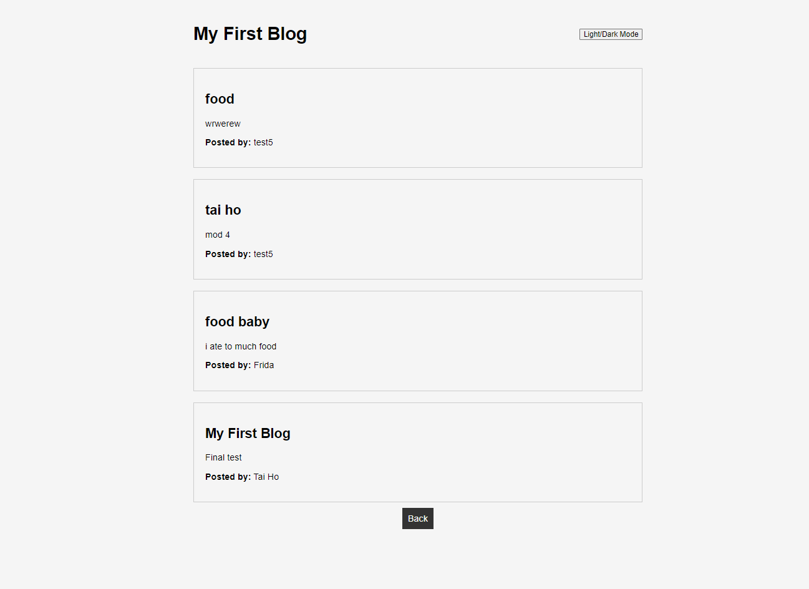
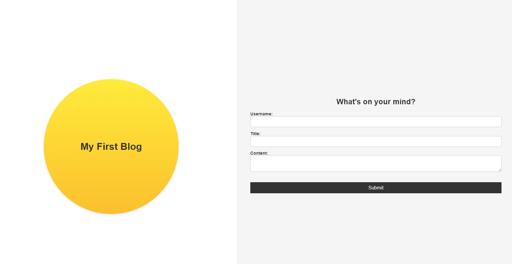

# My First Blog





## Description

This project is a simple two-page blog application built to allow users to create, store, and view blog posts. The blog allows users to submit a blog post through a form and view previously posted blogs on a separate page. It also includes a light/dark mode toggle feature.

- **Motivation**: The motivation for building this project was to create an easy-to-use blogging platform where users can express their thoughts and experiences.
- **Problem Solved**: The blog provides a straightforward way for users to submit and view blog posts, and the light/dark mode feature enhances user experience with customizable themes.
- **What I Learned**: Through this project, I gained experience in DOM manipulation, using localStorage for data persistence, and implementing dynamic theme switching using JavaScript.

## Table of Contents

- [Installation](#installation)
- [Usage](#usage)
- [Credits](#credits)
- [License](#license)

## Installation

To run this project locally, follow these steps:

1. Clone the repository:
   ```bash
   git clone <your-repository-url>
